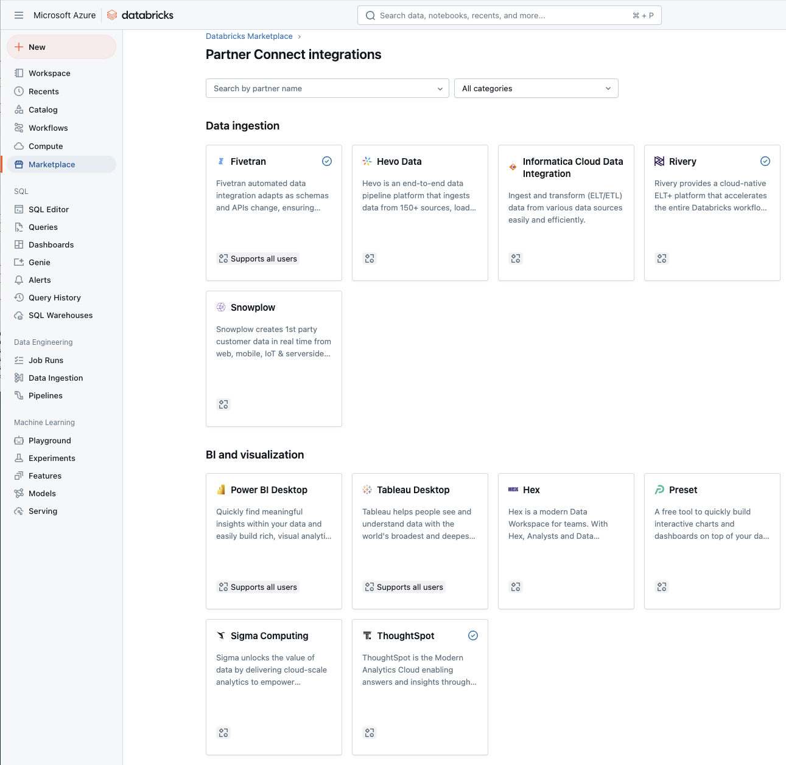
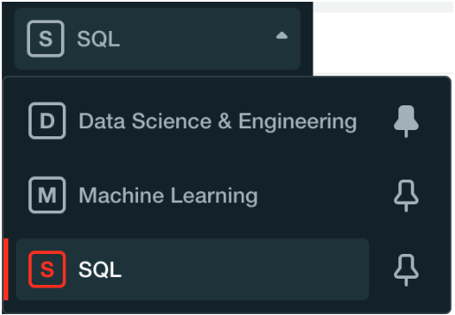
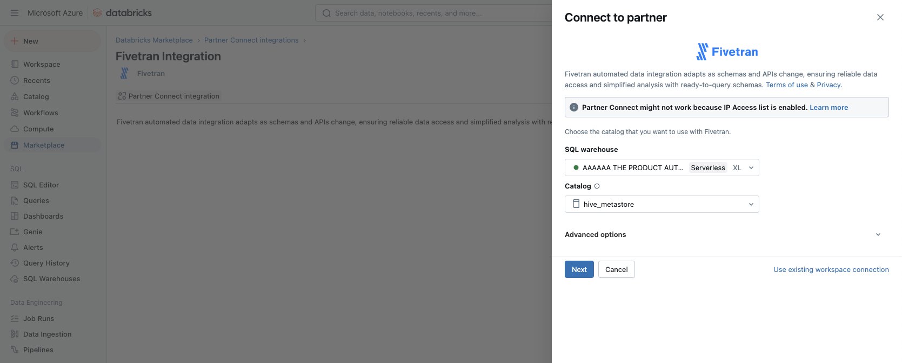
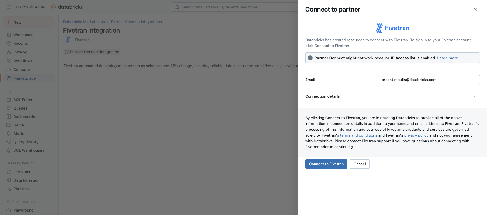
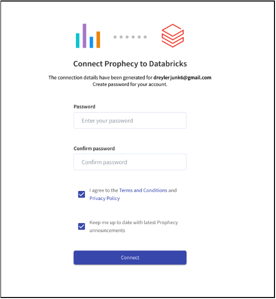

# Partner Onboarding, Databricks Partner Connect (V2.1.0)

## How does a partner onboard to Partner Connect?
- [Partner Connect onboarding lifecycle](OnboardingLifecycleDoc.md)
- [API Specifications](ApiSpecifications.md)
- [Test cases](OnboardingTestCases.md)
- [Validation criteria](OnboardingValidationDoc.md)
- [Technical FAQ](TechnicalFAQ.md)

## What is Partner Connect?

Partner Connect is a destination inside a Databricks workspace that allows Databricks customers to easily discover and connect a broad set of data and AI tools they know they can trust to their lakehouse.

We made Partner Connect for 2 reasons:

1. We want to give our customers access to the value provided by the best data products in the market. Partner Connect removes the complexity from connecting products to Databricks by automatically configuring resources such as SQL Warehouses, clusters, PAT tokens, service principals, and connection files. It can also initiate a free trial of partner products.
2. We want to help our partners build their businesses and incentivize them to create the best possible product experience for Databricks customers. For more on this topic, see [this blog post](https://databricks.com/blog/2021/11/18/build-your-business-on-databricks-with-partner-connect.html).

### Sample marketing materials and user experience demo

Check out these videos we made explaining our Partner Connect integration with [Fivetran](https://www.youtube.com/watch?v=ONvh4MOTYwI) and [Prophecy](https://www.youtube.com/watch?v=mh-6lpYJcqs) to better understand the intended user experience and value proposition for customers.

### Glossary

The following phrases will help you understand the Databricks product and this document.

- **Databricks Account:** This is the customer-level object. Each customer has only 1 account. Customers can have multiple workspaces in an account.
- **Databricks Workspace:** This is the product-level object that users interact with when they use Databricks. All users, user-created content (for example dashboards, jobs, and notebooks), and access controls for that content are part of a workspace. Customer data is not tied to a workspace, and the same data can be made available in multiple workspaces. API calls from partners are made to a workspace.
- **Persona Switcher:** The component on the upper left of the UI that allows the user to choose the active Databricks product. This controls which features are available in the UI, and not all users have access to all 3 options. Partner Connect is available to all 3 personas.
- **Personal Access Token (PAT):** A token that a partner product can use to authenticate with Databricks
- **Service Principal:** An account that a partner product can use when calling Databricks APIs. Service Principals have access controls associated with them.

The persona switcher can take on 1 of 3 values, which are a good categorization of the 3 broad types of Databricks usage:

- **SQL** (aka **DBSQL** ), is primarily focused on SQL workloads and dashboarding. **SQL Warehouses** can be made available to partner products via JDBC/ODBC for SQL workloads.
- **Data Science &amp; Engineering** is primarily focused on the notebook interface and scheduling jobs. SQL, Python, Scala, and R are available. The **All Purpose Clusters** API (aka **REST API 1.2** aka **Interactive Clusters** API) is typically used for development, and the **Databricks Jobs** API (aka **REST API 2.0** ) is typically used for scheduling production jobs, and partner products can call both these APIs. A **Cluster** is a compute resource that has been provisioned to execute both of the above categories of Data Science &amp; Engineering workloads.
- **Machine Learning** has a similar notebook interface and APIs to the Data Science and Engineering persona, but the home page is focused on resources necessary for machine learning use cases and additional features are available, such as Repos and Experiments.

### Expected User Experience

The steps below are an example Partner Connect integration. Your implementation may differ.

1. A Databricks user visits Partner Connect in their workspace (see Image 1)
2. The user clicks the partner&#39;s tile (see Image 2)
 

**Image 2**

3. The user clicks &#39;Next&#39; in the screen above, and Databricks provisions a Service Principal, PAT, and SQL Warehouse. Clusters can also be provisioned if needed, and users can set destination location under &#39;advanced options&#39;.

**Image 3**

4. The user clicks &#39;Connect to [partner]&#39; (see Image 3), and Databricks calls the partner&#39;s Connect API with the user&#39;s email address, workspace ID, and additional fields. Databricks will redirect the user to the URL provided by the partner in the response to the Connect API.

The key to creating a seamless user experience is to respond in the best way to the user&#39;s specific context. **Partners can and should respond with different redirect URLs** depending on variables such as:

- Is this a new user and company, from the partner&#39;s perspective? ( **new logo** opportunity)
- Does the user&#39;s email address already exist in a partner account? ( **sign in** attempt)
- Is this a new user, but from a company that already has an active partner account? ( **expansion** opportunity)
- Is the user associated with an expired free trial partner account? ( **re-activation** opportunity)

See the API Specifications section for details on the above.

5. Often the correct partner response will be to create a new free trial account for the user and connect it to the Databricks workspace. In this case, the partner need only ask the user to set their password. (See Image 4).
6. Once the user is in the partner product, they should have access to connect to Databricks using the connection string and credentials without requiring manual configuration.  It should be obvious to a user how to get started using the Databricks connection.

**Image 4**

We realize that the expected user experience above may not be optimal for all partner products, which is why we are giving partners the ability to respond with multiple URLs to the Connect API, depending on the context. We ask that you enumerate the scenarios and corresponding URLs when you provide Databricks with the required artifacts.

### What types of integrations are supported by Partner Connect?
While there's some customization available, most partners have one of the following integrations:

| Integration | Description |
|------------- | -------------|
| Read Partner | This is used by partners that purely need to read (select) data from the Lakehouse.  In Partner Connect, the user selects which data to grant access to your product.  Databricks provides the partner a SQL Warehouse and PAT with permissions to query that data.  This is often used by **Business Intelligence and Data Quality partners**.
| Write Partner | This is used by partners that purely need to write (ingest) data into the Lakehouse.  In Partner Connect, the user selects which catalog to grant write access to your product.  Databricks provides the partner a SQL Warehouse and PAT with permissions to create schemas and tables in that catalog.  This is often used by **Ingestion partners**.
| Read-Write Partner | This is used by partners that both need to read from and write to the Lakehouse.  In Partner Connect, the user selects which catalog to grant write access and which schemas to grant read access for your product.  Databricks provides the partner a SQL Warehouse and PAT with permissions to create schemas and tables in that catalog, as well as query the selected data.  This is often used by **Data Preparation partners**.
| Notebook Partner | This is used by partners that want to demonstrate their integration with Databricks using a Databricks Notebook.  Databricks provides the partner an Interactive Cluster and PAT with permissions.  The partner can use the PAT to publish a Databricks Notebook and configure the Interactive Cluster.
| Desktop application Partner | This is used by partners that have a Desktop application (as opposed to a SaaS offering).  In this integration, the user selects either an Interactive Cluster or SQL Warehouse and downloads a connection file to the partner product.  This is often used by **Partners with Desktop applications**.  N.B.  For this type of integration, there is no need for the partner to implement the SaaS APIs mentioned elsewhere throughout this documentation.

## Changelog

### V2.1.0
- Added delete-connection API implementation on Databricks's side to notify partners about connection deletion.
- Added cloud_provider and databricks_organization_id to the delete-connection api request.
- Added field resource_status to delete-connection API success response.
- Added additional supported error codes (401, 404) to delete-connection API failure response.

### V2.0.6
- General restructuring of onboarding documentation until multiple subpages.
- Added [Technical FAQ](TechnicalFAQ.md) that addresses common questions we receive from partners.
- Added [Validation documentation](OnboardingValidationDoc.md) that removes ambiguity of how validation works.
- Added/Moved [Test Cases](OnboardingTestCases.md) that explicitly explains each test case and the criteria for validation.
- Added [Onboarding Lifecycle](OnboardingLifecycleDoc.md) that explicitly explains the end-to-end steps for a partner to onboard.
- Moved API specification information from the high-level [Onboarding Doc](OnboardingDoc.md) to the [API Specification Doc](ApiSpecifications.md).
- Added a list of common Partner Connect integrations to [Onboarding Doc](OnboardingDoc.md#what-types-of-integrations-are-supported-by-partner-connect).
- Several pieces of information that were implicit before (e.g. hostname validation, usability validation) have been made explicit throughout.

### V2.0.5
- Added SEMANTIC_LAYER and DATA_GOVERNANCE categories
- Added new UC data privileges to the Enum.  These are unused by the test suite, but reflect per-partner configuration in Databricks.

### V2.0.4
- Added databricks_jdbc_url to the connect api for use with the new Databricks JDBC driver. 
- Added is_sql_warehouse to the connect api.  
- Updated the doc to show the recent renaming from SQL endpoint to SQL warehouse. 

### V2.0.3
- Added service_principal_id to the connect request.
- Removed 'reserved for future use' for catalog_name and clarified the possible value.

### V2.0.2
- Separated delete-account and delete-connection apis.
- Added cloud_provider and databricks_organization_id to the delete-account and test-connection apis.
- Clarified that cluster_id is an optional field. It's only required if SQL endpoint or Interactive Cluster is used.
- Clarified that databricks_user_id and databricks_organization_id are longs.
- Make it clear that there is an expectation that users need not manually enter connection details.
- Add an expire-account api for automated tests.
- Add Links to the artifact submission forms. Test-Connection error cases (404) added.
- Update the Artifact requirements to be in sync with  artifact submission form.
- Get Connectors List should specify how pagination_token will be sent.
- Remove best practice doc link.

### v2.0.1

- Added status\_code and connection\_id to examples in &quot;Example partner scenarios&quot; table.
- Added &quot;Headers&quot; section that was mistakenly removed between v1 and v2 docs.
- Added 400 error response to Connect API.
- Added connection\_id to Connect API request (only present if is\_connection\_established is true).
- Updated Failure Response format. All failures (4xx and 5xx) now contain the same 3 fields.
- Updated Connect API 404 response &quot;Account or Connection not found&quot; to handle more cases.
- Clarified which Connect API properties are required, optional, or unused.
- Enumerated accepted values for Connect API response property &quot;redirect\_value&quot;.
- Updated the handling of Connect API response properties &quot;connection\_id&quot; and &quot;configured\_resources&quot;.
- Added section on Databricks data model to explain accounts, workspaces, users, and connections.
- Updated Get Connectors List API.
- Added external links in the &quot;Resources&quot; section to &quot;Best Practices for building an integration with Databricks&quot;, &quot;Connectors List&quot;, and &quot;OpenApi specification&quot;.
