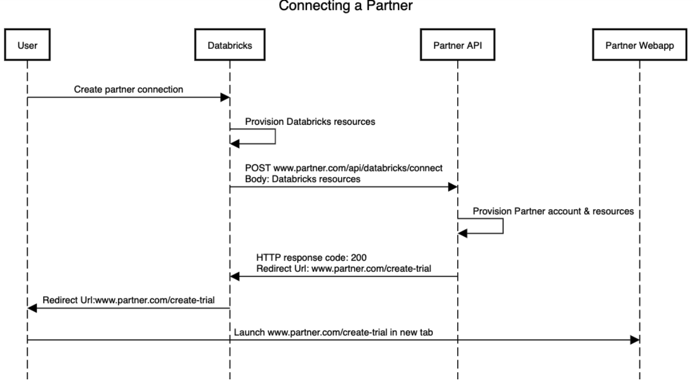

# Partner Onboarding, Databricks Partner Connect (V2.0.2)

# Overview
- [Partner Onboarding, Databricks Partner Connect (V2.0.2)](#partner-onboarding-databricks-partner-connect-v202)
- [Overview](#overview)
  - [Document scope](#document-scope)
  - [Glossary](#glossary)
  - [What is Partner Connect?](#what-is-partner-connect)
  - [Sample marketing materials and user experience demo](#sample-marketing-materials-and-user-experience-demo)
- [Expected User Experience](#expected-user-experience)
- [API overview](#api-overview)
  - [OpenApi Specification](#openapi-specification)
  - [Headers](#headers)
          - [Request Headers](#request-headers)
          - [Response Headers](#response-headers)
- [Connection API (All Partners)](#connection-api-all-partners)
  - [Connect](#connect)
      - [Sequence diagram](#sequence-diagram)
      - [Redirect URL explanation](#redirect-url-explanation)
      - [Example partner scenarios](#example-partner-scenarios)
      - [A note on established connections](#a-note-on-established-connections)
      - [API Specification](#api-specification)
        - [Databricks data model](#databricks-data-model)
- [Datasource API (Ingestion Partners)](#datasource-api-ingestion-partners)
  - [Get Connector List](#get-connector-list)
      - [Get Connector List API Example](#get-connector-list-api-example)
- [Regression Testing APIs](#regression-testing-apis)
  - [Test Connection API](#test-connection-api)
  - [Delete Account API](#delete-account-api)
  - [Delete Connection](#delete-connection)
  - [Expire Account](#expire-account)
- [Artifacts Required From All Partners](#artifacts-required-from-all-partners)
  - [Enable Databricks to demo partner products with Partner Connect](#enable-databricks-to-demo-partner-products-with-partner-connect)
      - [Demo boolean flag](#demo-boolean-flag)
- [Resources](#resources)
- [Changelog](#changelog)
  - [V2.0.2](#v202)
  - [v2.0.1](#v201)
## Document scope

The first step towards adding your product to Partner Connect is having a solid product integration with Databricks. This document assumes partners already have that. For more details on product integration, please see &quot;Best practices for building an integration with Databricks&quot; in Resources (below).

## Glossary

The following phrases will help you understand the Databricks product and this document.

- **Databricks Account:** This is the customer-level object. Each customer has only 1 account. Customers can have multiple workspaces in an account.
- **Databricks Workspace:** This is the product-level object that users interact with when they use Databricks. All users, user-created content (for example dashboards, jobs, and notebooks), and access controls for that content are part of a workspace. Customer data is not tied to a workspace, and the same data can be made available in multiple workspaces. API calls from partners are made to a workspace.
- **Persona Switcher:** The component on the upper left of the UI that allows the user to choose the active Databricks product. This controls which features are available in the UI, and not all users have access to all 3 options. Partner Connect is available to all 3 personas.
- **Personal Access Token (PAT):** A token that a partner product can use to authenticate with Databricks
- **Service Principal:** An account that a partner product can use when calling Databricks APIs. Service Principals have access controls associated with them.


The persona switcher can take on 1 of 3 values, which are a good categorization of the 3 broad types of Databricks usage:

- **SQL** (aka **DBSQL** ), is primarily focused on SQL workloads and dashboarding. **SQL Endpoints** can be made available to partner products via JDBC/ODBC for SQL workloads.
- **Data Science &amp; Engineering** is primarily focused on the notebook interface and scheduling jobs. SQL, Python, Scala, and R are available. The **All Purpose Clusters** API (aka **REST API 1.2** aka **Interactive Clusters** API) is typically used for development, and the **Databricks Jobs** API (aka **REST API 2.0** ) is typically used for scheduling production jobs, and partner products can call both these APIs. A **Cluster** is a compute resource that has been provisioned to execute both of the above categories of Data Science &amp; Engineering workloads.
- **Machine Learning** has a similar notebook interface and APIs to the Data Science and Engineering persona, but the home page is focused on resources necessary for machine learning use cases and additional features are available, such as Repos and Experiments.

## What is Partner Connect?

Partner Connect is a destination inside of a Databricks workspace that allows Databricks customers to easily discover and connect a broad set of data and AI tools they know they can trust to their lakehouse.


**Image 1**

We made Partner Connect for 2 reasons:

1. We want to give our customers access to the value provided by the best data products in the market. Partner Connect removes the complexity from connecting products to Databricks by automatically configuring resources such as SQL endpoints, clusters, PAT tokens, service principals, and connection files. It can also initiate a free trial of partner products.
2. We want to help our partners build their businesses and incentivize them to create the best possible product experience for Databricks customers. For more on this topic, see [this blog post](https://databricks.com/blog/2021/11/18/build-your-business-on-databricks-with-partner-connect.html).

## Sample marketing materials and user experience demo

Check out these videos we made explaining our Partner Connect integration with [Fivetran](https://www.youtube.com/watch?v=ONvh4MOTYwI) and [Prophecy](https://www.youtube.com/watch?v=mh-6lpYJcqs) to better understand the intended user experience and value proposition for customers.

# Expected User Experience

The steps below are an example Partner Connect integration. Your implementation may differ.

1. A Databricks user visits Partner Connect in their workspace (see Image 1)
2. The user clicks the partner&#39;s tile (see Image 2)
 


**Image 2**

3. The user clicks &#39;Next&#39; in the screen above, and Databricks provisions a Service Principal, PAT, and SQL Endpoint. Clusters can also be provisioned if needed, and users can set destination location under &#39;advanced options&#39;.


**Image 3**

4. The user clicks &#39;Connect to [partner]&#39; (see Image 3), and Databricks calls the partner&#39;s Connect API with the user&#39;s email address, workspace ID, and additional fields. Databricks will redirect the user to the URL provided by the partner in the response to the Connect API.

The key to creating a seamless user experience is to respond in the best way to the user&#39;s specific context. **Partners can and should respond with different redirect URLs** depending on variables such as:

- Is this a new user and company, from the partner&#39;s perspective? ( **new logo** opportunity)
- Does the user&#39;s email address already exist in a partner account? ( **sign in** attempt)
- Is this a new user, but from a company that already has an active partner account? ( **expansion** opportunity)
- Is the user associated with an expired free trial partner account? ( **re-activation** opportunity)

See the Requirements section for details on the above.

5. Often the correct partner response will be to create a new free trial account for the user and connect it to the Databricks workspace. In this case, the partner need only ask the user to set their password. (See Image 4).
6. Once the user is in the partner product, they should have access to connect to Databricks using the connection string and credentials without requiring manual configuration.


**Image 4**

We realize that the expected user experience above may not be optimal for all partner products, which is why we are giving partners the ability to respond with multiple URLs to the Connect API, depending on the context. We ask that you enumerate the scenarios and corresponding URLs when you provide Databricks with the required materials (see below).

# API overview

## OpenApi Specification

See &quot;OpenApi Specification&quot; in Resources (below)

## Headers

###### Request Headers

In the API requests, Databricks will include the following request headers:

```
"User-Agent": "databricks"
"Authorization": "Basic <base64 user:pwd>" [user:pwd provided by partner to Databricks for authentication]
"Content-Type": "application/json"
"Accept-Language": "user language" [en-US]
```

###### Response Headers

Partners need to include the following headers in all api responses that return JSON payload.

```
"Content-Type": "application/json"
```

Databricks will be authenticating using basic authentication with the partners.

# Connection API (All Partners)

## Connect

The Connect API is used to sign-in or sign-up a user with a partner with Databricks resources pre-configured.

#### Sequence diagram

The order of events when connecting Databricks to a partner is as follows:

1. The user clicks the Partner tile.
2. The user confirms the Databricks resources that will be provisioned for the connection (e.g. the Service Principal, the PAT, the SQL Endpoint).
3. The user clicks Connect.
   1. Databricks calls the partner&#39;s **Connect API** with all of the Databricks data that the partner needs.
   2. The partner provisions any accounts and resources needed. (e.g. persisting the Databricks workspace\_id, provisioning a Databricks output node).
   3. The partner responds with
      1. **HTTP status code** - for determining success, Databricks failure, and partner failure.
      2. **Redirect URL** - for Databricks to launch in a new browser tab.
      3. **Additional data** - see below.
4. Databricks launches the **Redirect URL** in a new browser tab.



#### Redirect URL explanation

The Redirect URL can be customized by the partner to handle different cases. Partners can embed arbitrary data (e.g. user info) into the URL. As a typical example, a partner may choose to implement the following URLs. Superscripts denote options for the same scenario depending on the partner&#39;s capabilities.

- [www.partner.com/create-trial](http://www.partner.com/create-trial)
    - Used when the partner has never seen the user or the account before.
    - ¹Used when the account has an expired trial (and the partner allows multiple trials per account)
- [www.partner.com/sign-in](http://www.partner.com/sign-in)
    - ²Used when the partner has never seen the user, but has seen the account, and can automatically provision the user.
    - Used when the partner has seen the user and the account.
- [www.partner.com/contact-your-admin](http://www.partner.com/contact-your-admin)
    - ²Used when the partner has never seen the user, but has seen the account, and cannot automatically provision the user.
- [www.partner.com/purchase-product](http://www.partner.com/purchase-product)
    - ¹Used when the account has an expired trial (and the partner does not allow multiple trials per account)

#### Example partner scenarios

|Scenario                                                           |Partner operations during Connect API|Response                                                                                                                                                                                                                                                                                                 |
|-------------------------------------------------------------------|-------------------------------------|---------------------------------------------------------------------------------------------------------------------------------------------------------------------------------------------------------------------------------------------------------------------------------------------------------|
|New user, new account                                              |<ul><li>Set up free trial for new account</li><li>Configure Databricks integration in account</li></ul>|**Status_code** = 200<br />**Connection_id** = abcd<br />**Configured_resources** = true<br />**User_status** = new<br />**Account_status** = new<br />**Redirect Value** = create_trial<br />**Redirect URL** = www.partner.com/create-trial                                                                                                                      |
|Expired account                                                    |<ul><li>If the partner requires the product to be purchased…<ul><li>N/A</li></ul><li>If it allows another free trial</li><ul><li>Set up free trial</li><li>Configure Databricks integration</li></ul></ul>|**Status_code** = 200<br />**Connection_id** = omitted OR abcd<br />**Configured_resources** = false OR true<br />**User_status** = new OR existing<br />**Account_status** = expired<br />**Redirect Value** = purchase_product OR create_trial<br />**Redirect URL** = www.partner.com/purchase-product OR www.partner.com/create-trial                          |
|New user, existing account                                         |<ul><li>If the user can be added dynamically…</li><ul><li>Add the user</li><li>Configure Databricks integration</li></ul><li>If not…<ul><li>No action OR</li><li>Set up free trial for new user and configure Databricks integration</li></ul></ul>|**Status_code** = 200<br />**Connection_id** = abcd or omitted<br />**Configured_resources** = true OR false<br />**User_status** = new<br />**Account_status** = active<br />**Redirect Value** = sign_in OR contact_admin OR create_trial<br />**Redirect URL** =  www.partner.com/sign-in  OR www.partner.com/contact-your-admin OR www.partner.com/create-trial|
|Existing user, existing account                                    |<ul><li>Configure Databricks integration</li></ul>     |**Status_code** = 200<br />**Connection_id** = abcd or omitted<br />**Configured_resources** = true OR false<br />**User_status** = existing<br />**Account_status** = active<br />**Redirect Value** = sign_in<br />**Redirect URL** =  www.partner.com/sign-in                                                                                                   |

#### A note on established connections

Databricks and the partner may have different values for whether the connection is established. A user may delete the connection on either the Databricks-side or the partner-side causing this mismatch. Here&#39;s what should happen with the Connect API in each of the 4 cases.

1. If Databricks has no connection configured, it will send a payload with **is\_connection\_established** set to **false**.
   1. If the partner has no connection configured, they will configure the connection.
   2. If the partner has a connection configured, they will configure a new, separate connection. This can happen if a connection was previously deleted on the Databricks-side or if a connection was manually configured from the partner to Databricks outside of Partner Connect.
2. If Databricks has a connection configured, it will send a payload with **is\_connection\_established** set to **true**.
   1. If the partner has no connection configured, the partner responds with 404 connection\_not\_found so that Databricks can tell the user to take action.
   2. If the partner has a connection configured, no new connection needs to be configured.

#### API Specification

##### Databricks data model

- A company or an organization has a Databricks **account**. We do not provide an identifier that represents the account to partners.
- An account can have multiple Databricks **workspaces**. A workspace is the logical container and isolation boundary for Databricks resources (e.g. SQL Endpoints). Databricks\_organization\_id and workspace\_id are interchangeable as the appropriate identifier. Partner Connect is accessed within a workspace.
- A **user** can belong to multiple workspaces. A user has a unique email address. A user&#39;s identifier is databricks\_user\_id which is unique within a cloud (e.g. Azure).
- Partner Connect stores 0 or 1 **connections** per partner per workspace.

Databricks will pass the below standard fields to your API. In order to be in Partner Connect, we need your API to support all of the mandatory fields, meaning that even if you receive information you don&#39;t need, you shouldn&#39;t return an error. If there are some additional fields that you would like us to support, do let us know through your partner representative.

```
POST <partners/databricks/v1/connect>: [example, can be customized]
{
  "user_info": {
     "email": "john.doe@databricks.com", [valid email address]
     "first_name": "John", [Non-null String, may be empty string]
     "last_name": "Doe", [Non-null String, may be empty string]
     "databricks_user_id": 1234567890, [data-type is long]
     "databricks_organization_id": 1234567890, [data-type is long]
     "is_connection_established" : true|false
     "auth": { [Only present if is_connection_established is false]
       "personal_access_token": "dapi..."
       // or
       "oauth_token": ..., [optional, reserved for future use]
       "oauth_scope": ... [optional, reserved for future use]
      }
  }
  "hostname": "organization.cloud.databricks.com",
  "port": 443,
  "workspace_url": "https://[organization/prefix-workspaceid/string].cloud.databricks.com/?o=12345677890",
  "http_path": "sql/protocolv1/o/0/0222-185802-deny427", [optional, set if is_sql_endpoint is true]
  "jdbc_url": "jdbc:spark://organization.cloud.databricks.com:443/...", [optional, set if is_sql_endpoint is true]                 
  "connection_id": "7f2e4c43-9714-47cf-9011-d8148eaa27a2", [example, optional, only present when is_connection_established is true]
  "workspace_id": 1234567890, [same as user_info.organization_id]
  "demo": true|false, [see Demos section below]
  "cloud_provider": "azure", [or aws or gcp]
  "region": "us-east-2", [or]
  "is_free_trial": true|false, [is Databricks free trial]
  "staging_location": "<cloud>://<location_1>", [optional, reserved for future use]
  "destination_location": "<cloud>://<location_2>", [optional]
  "catalog_name" : "catalog name or namespace name",[optional, reserved for future use]
  "database_name" : "default database to use", [optional, reserved for future use]
  "cluster_id": "0222-185802-deny427", [optional: set only if jdbc/interactive cluster is required.]
  "is_sql_endpoint" : true|false, [optional: set if cluster_id is set.  Determines whether cluster_id refers to Interactive Cluster or SQL Endpoint] 
  "data_source_connector": "Oracle" [optional, reserved for future use: for data connector tools, the name of the data source that the user should be referred to in their tool]
}
```

**Successful Responses:**

```
Status Code: 200
{
  "redirect_uri": "https://...",
  "redirect_value": "create_trial", [example]
  "connection_id": "7f2e4c43-9714-47cf-9011-d8148eaa27a2", [example, optional, see below]
  "user_status": "new", [example]
  "account_status": "existing", [example]
  "configured_resources": true|false
 }
```
Return values:

1. **redirect\_uri** - the URL to launch in a new browser tab
2. **redirect\_value** - a String that identifies the redirect\_uri scenario. This will be used to verify correct behavior in automated testing. Valid values are &quot;create\_trial&#39;, &quot;purchase\_product&quot;, &quot;sign\_in&quot;, &quot;contact\_admin&quot;, and &quot;not\_applicable&quot;.
3. **connection\_id** - a String that identifies the connection in the Partner&#39;s system. This may be used as part of future improvements (See Optional section below).
   1. If **is\_connection\_established** is true in the request, **connection\_id** should be omitted in the response.
   2. If **is\_connection\_established** is false and **configured\_resources** is true, **connection\_id** must be present in the response
   3. If **is\_connection\_established** is false and **configured\_resources** if false, **connection\_id** should be omitted in the response.
4. **user\_status** - a String that represents whether the partner has seen the user before. Valid values are &quot;new&quot;, &quot;existing&quot;, and &quot;not\_applicable&quot;.
5. **account\_status** - a String that represents whether the partner has seen the account (i.e. the company or email domain) before. Valid values are &quot;new&quot;, &quot;active&quot;, &quot;expired&quot;, and &quot;not\_applicable&quot;.
6. **configured\_resources** - a boolean that represents whether the partner configured/persisted the Databricks resources on this Connect API request.
   1. If **is\_connection\_established** is true, **configured\_resources** must be set, but will be ignored.
   2. If **is\_connection\_established** is false and **configured\_resources** is false, Databricks will delete the resources it provisioned.

**Failure Responses:**

All failure responses contain the same 3 fields:

1. **error\_reason** - Required; must be set to the appropriate enum value.
2. **display\_message** - Not required; will be displayed to the user if set in the case of 404 or 500
3. **debugging\_message** - Not required; will be logged if set.

_Bad request_

Thrown when Databricks provides a malformed request to the partner. This should never happen.

```
Status Code: 400
{
  "error_reason": "bad_request",
  "display_message": "foobar", [optional, not displayed for 400]
  "debugging_message": "foobar" [optional]
 }
```

_Bad credentials_

Thrown when Databricks provides the wrong credentials to the partner. This should never happen, but may happen in cases where credentials need to be rotated. Databricks will present the link to the sign in page for the partner.

```
Status Code: 401
{
  "error_reason": "unauthorized",
  "display_message": "foobar", [optional, not displayed for 401]
  "debugging_message": "foobar" [optional]
}
```

_Account or Connection not found_

Should only be possible if Databricks sends with **is\_connection\_established** set to **true**.

1. If the connection does not exist on the partner-side, return a 404 with **error\_reason** set to **connection\_not\_found**. This occurs when a connection has been deleted on the partner side. The user will be directed to delete the connection in Databricks and re-create.
2. If the account does not exist on the partner-side, return a 404 with **error\_reason** set to **account\_not\_found**. This occurs when a partner wishes to create separate connections from a single Databricks workspace to multiple partner workspaces (e.g. one for each user). The user will be directed to contact their admin for an invite to an existing workspace or to delete the existing connection and recreate, which is a destructive operation. Improvements are planned for this workflow.

```
Status Code: 404
{
  "error_reason": "account_not_found", [or “connection_not_found”]
  "display_message": "foobar", [optional, will be displayed if present]
  "debugging_message": "foobar" [optional]
}
```

_Unexpected failure_

For any other unexpected failures, the partner will return a 500. Databricks will retry the request 3 times with exponential backoff: first request after 1 second, second request after 2 seconds, and third request after 4 seconds. If Databricks continues to receive a 500, Databricks will present the resources that are created in the UI, but provide a link to the regular sign in page for the partner.

```
Status Code: 500
{
  "error_reason": "general_error",
  "display_message": "foobar", [optional, will be displayed if present]
  "debugging_message": "foobar" [optional]
}
```

# Datasource API (Ingestion Partners)

## Get Connector List

The partner should provide a REST GET api that returns the list of connectors they support. Partners are responsible for using the Databricks provided list of identifiers (see &quot;Connectors List&quot; in Resources below) to map the data source connectors.

#### Get Connector List API Example

`GET /partners/databricks/v1/connectors?pagination\_token=101`

Response:

```
{
  "connectors": [{
     "identifier": "DATABRICKS_CONNECTOR1_ID",
     "name": "connector name1",
     "type": "source", [or “target”]
     "description": "Connects to ..." [optional]
   },
   {
     "identifier": "DATABRICKS_CONNECTOR2_ID",
     "name": "connector name1",
     "type": "source", [or “target”]
     "description": "Connects to ..." [optional]
   }, ...
 ],
 "Pagination_token": 101 // A token to continue listing
}
```

# Regression Testing APIs
The following apis are required for automated certification tests. Once partners implement these apis, they can use the [partner certification tests](README.md#partner-connect-certification) to validate the user scenarios.

## Test Connection API

This api is currently only used in automated tests. In the future it may be included in the partner connect experience.

```
POST <partners/databricks/test-connection>:
{
  "connection_id": "7f2e4c43-9714-47cf-9011-d8148eaa27a2",
  "cloud_provider": "azure", [or aws or gcp]
  "databricks_organization_id": 123456789012345678,
}
```

**Successful Responses:**

```
Status Code: 200
{
  "test_results": [
    {
        "test_name": "Connectivity",
        "status": "SUCCESS",
        "message": "Successfully connected to host"
    },
    {  
        "test_name": "Permissions",
        "status": "FAILED",
        "message": "WRITE permission check failed to database"
    }   
  ]
 }
```

**Failure Responses:**

_Connection not found._

```
Status Code: 404
{
  "error_reason": "connection_not_found"
  "display_message": "foobar", [optional, will be displayed if present]
  "debugging_message": "foobar" [optional]
}
```

_Unexpected failure_

```
Status Code: 500
{
  "error_reason": "general_error",
  "display_message": "foobar", [optional]
  "debugging_message": "foobar" [optional]
}
```

## Delete Account API

This api will clean up all the resources provisioned for a given account based on the domain name, 
cloud provider and org id (workspace\_id).
This api needs to be limited to databricks test domain names (databricks-test.com and databricks-demo.com). 
Delete api should throw 400 Bad requests if it&#39;s called for any other domain name. 
This api is currently only used in automated tests.

```
DELETE <partners/databricks/account>:
{
  "domain": "abc123.databricks-test.com",
 "cloud_provider": "azure", [or aws or gcp]
 "databricks_organization_id": 123456789012345678,
}
```

**Successful Responses:**

```
Status Code: 200
```

**Failure Responses:**

_Bad Request_

```
Status Code: 400
{
  "error_reason": "bad_request",
  "display_message": "foobar", [optional]
  "debugging_message": "foobar" [optional]
}
```

_Unexpected failure_

```
Status Code: 500
{
  "error_reason": "general_error",
  "display_message": "foobar", [optional]
  "debugging_message": "foobar" [optional]
}
```

## Delete Connection

This api should clean up a specific connection id in a given org id (workspace\_id) and cloud provider.
This api is currently only used in automated tests.

```
DELETE <partners/databricks/connection>:
{
  "connection_id": "7f2e4c43-9714-47cf-9011-d8148eaa27a2",
 "cloud_provider": "azure", [or aws or gcp]
 "databricks_organization_id": 123456789012345678,
}
```

Successful Responses:

```Status Code: 200```

Failure Responses:

Unexpected failure

```
Status Code: 500
{
  "error_reason": "general_error",
  "display_message": "foobar", [optional]
  "debugging_message": "foobar" [optional]
}
```

## Expire Account

Expire account api is used to expire a user trial. After this api is called, the partner is expected to return the redirect uri for handling expired users.
The **account\_status** should be set to **expired**. 
This api is only used for automated verification of the partner connect flow for expired accounts.
This api needs to be limited to databricks test domain names (databricks-test.com and databricks-demo.com). 
Partners should return 400 bad requests if it&#39;s called for any other domain name. 
This is an optional api if the partner doesn&#39;t support time-based account expiry.

```
PUT <partners/databricks/useraccount>:
{
 "email": "test@test.com",
 "databricks_user_id": 123456789012345678,
 "cloud_provider": "azure", [or aws or gcp]
 "databricks_organization_id": 123456789012345678,
}
```

**Successful Responses:**

```
Status Code: 200
```

**Failure Responses:**

_Unexpected failure_

```
Status Code: 500
{
  "error_reason": "general_error",
  "display_message": "foobar", [optional]
  "debugging_message": "foobar" [optional]
}
```

# Artifacts Required From All Partners
Follow the following steps to submit artifacts: 
1. Submit the [Tech due diligence form](https://docs.google.com/forms/d/e/1FAIpQLSftDtJiqKirOL81_4ZTRM-bu27lmjZcEvOl4mGryyZ1WpTBHg/viewform) to start the onboarding process
2. Follow the [Partner Connect Certification](README.md#partner-connect-certification) to test the api implementation and generate certificaiton test report. 
3. Submit all required artifacts (including certification test report and partner configuration files) using [Artifact submission form](https://docs.google.com/forms/d/e/1FAIpQLSc2vcAqAOVlE7Llo3GMhLrK3klzYXQ5LeWyqaR6L20RjHpygQ/viewform)


## Enable Databricks to demo partner products with Partner Connect

We would like to demo select partner products to our field team and in Partner Connect product demonstrations. 
In order to do this, we need to ensure that partners return the Create Trial experience even when the same email, account,
and workspace are repeatedly used.

#### Demo boolean flag

The Connect API request includes a &quot; **demo**&quot; boolean flag that we will set to true only when demo-ing your product. When true, ensure we get the Create Trial flow, even if you&#39;ve seen the user, account, and/or Databricks workspace before

# Resources
- [OpenApi specification](openapi/partner-connect-2.0.yaml)
- [Connectors List](openapi/connectors.csv)

# Changelog

## V2.0.2
- Separated delete-account and delete-connection apis.
- Added cloud_provider and databricks_organization_id to the delete-account and test-connection apis.
- Clarified that cluster_id is an optional field. It's only required if SQL endpoint or Interactive Cluster is used.
- Clarified that databricks_user_id and databricks_organization_id are longs.
- Make it clear that there is an expectation that users need not manually enter connection details.
- Add an expire-account api for automated tests.
- Add Links to the artifact submission forms. Test-Connection error cases (404) added.
- Update the Artifact requirements to be in sync with  artifact submission form.
- Get Connectors List should specify how pagination_token will be sent.
- Remove best practice doc link.

## v2.0.1

- Added status\_code and connection\_id to examples in &quot;Example partner scenarios&quot; table.
- Added &quot;Headers&quot; section that was mistakenly removed between v1 and v2 docs.
- Added 400 error response to Connect API.
- Added connection\_id to Connect API request (only present if is\_connection\_established is true).
- Updated Failure Response format. All failures (4xx and 5xx) now contain the same 3 fields.
- Updated Connect API 404 response &quot;Account or Connection not found&quot; to handle more cases.
- Clarified which Connect API properties are required, optional, or unused.
- Enumerated accepted values for Connect API response property &quot;redirect\_value&quot;.
- Updated the handling of Connect API response properties &quot;connection\_id&quot; and &quot;configured\_resources&quot;.
- Added section on Databricks data model to explain accounts, workspaces, users, and connections.
- Updated Get Connectors List API.
- Added external links in the &quot;Resources&quot; section to &quot;Best Practices for building an integration with Databricks&quot;, &quot;Connectors List&quot;, and &quot;OpenApi specification&quot;.