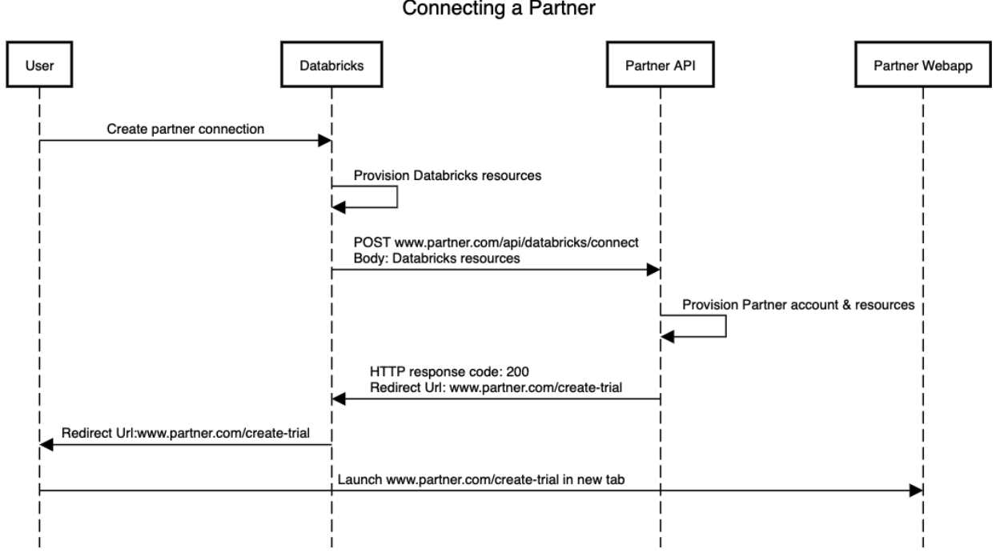
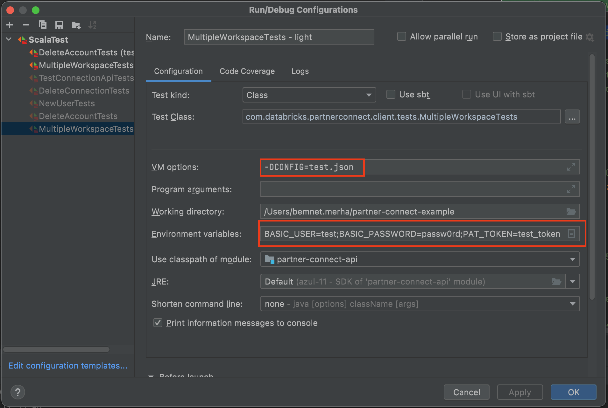

[](https://github.com/databricks/partner-connect-api/actions/workflows/scala.yml)


# Partner Connect API Contract

- [Partner Connect API Contract](#partner-connect-api-contract)
  - [Partner Onboarding Document](#partner-onboarding-document)
  - [Sequence Diagram](#sequence-diagram)
  - [API Spec](#api-spec)
  - [API Documentation](#api-documentation)
  - [System Requirements.](#system-requirements)
  - [Partner Connect Certification](#partner-connect-certification)
    - [1. Create partner config](#1-create-partner-config)
    - [2. Run certification tests](#2-run-certification-tests)
      - [Partner Certification test cases.](#partner-certification-test-cases)
    - [3. Self-test the integration](#3-self-test-the-integration)
    - [4. Upload artifacts](#4-upload-artifacts)
  - [Build and Run sample tests](#build-and-run-sample-tests)
    - [Using Docker](#using-docker)
      - [Setup Docker Environment](#setup-docker-environment)
      - [Run server](#run-server)
      - [Run tests](#run-tests)
    - [Using maven](#using-maven)
      - [Setup Environment](#setup-environment)
      - [Code gen](#code-gen)
      - [Format code](#format-code)
      - [Check format](#check-format)
      - [Run tests](#run-tests-1)
      - [Export credentials as environment variable](#export-credentials-as-environment-variable)
      - [Debug Tests](#debug-tests)
      - [Generate test report](#generate-test-report)
      - [Generate license report](#generate-license-report)
      - [Update dependencies to latest](#update-dependencies-to-latest)
      - [Generate api doc](#generate-api-doc)
  - [Troubleshooting](#troubleshooting)
  - [Reference](#reference)

## Partner Onboarding Document
[Partner Onboarding](OnboardingDoc.md)

## Sequence Diagram



An explanation of the sequence of events when connecting Databricks and a partner can be found in [ApiSpecifications.md](ApiSpecifications.md#sequence-diagram).

## API Spec
[Api Spec](openapi/partner-connect-2.0.yaml)

## API Documentation
[Api Doc](api-doc/README.md)

## System Requirements.
This project supports the following systems.
 - Linux (Tested with ubuntu-20.04)
 - macOS (Tested with BigSur 11.6.4)

## Partner Connect Certification
In order to onboard as a partner in Databricks Partner Connect, we require partners to validate their API implementation
using the test suites provided in this project. Before running the tests against your API,
it is recommended that you run the [sample tests](#build-and-run-sample-tests) to make sure your environment is set up correctly.
Follow the below steps to validate your API implementation.
1. Create a partner config file.
2. Run certification tests.
3. Test using the self-testing partner CLI/APIs.
4. Upload artifacts.

###  1. Create partner config
Partners need to create a config file to specify the partner service endpoint, and other relevant details used by the tests in this repo.
- See sample config files under `partners/test`
- See the PartnerConfig definition under `openapi/partner-connect-2.0.yaml`
- Create a config file under the `partners/test` directory and use the name of the file to run tests against it.

<details>
  <summary>Partner Configuration Properties</summary>

| name                   | type   | required | example                                                                                                                                                                                                                                                                                                                                                                                                                                  | description                                                                                                                                                                                                                                                        |
|------------------------|--------|----------|------------------------------------------------------------------------------------------------------------------------------------------------------------------------------------------------------------------------------------------------------------------------------------------------------------------------------------------------------------------------------------------------------------------------------------------|--------------------------------------------------------------------------------------------------------------------------------------------------------------------------------------------------------------------------------------------------------------------|
| api_version            | string | yes      | 2.1.0                                                                                                                                                                                                                                                                                                                                                                                                                                    | The partner api version supported by the partner. Format major.minor.patch                                                                                                                                                                                         |
| name                   | string | yes      | test partner                                                                                                                                                                                                                                                                                                                                                                                                                             | Name of the partner                                                                                                                                                                                                                                                |
| description_blurb      | string | yes      | Partner Connect test partner                                                                                                                                                                                                                                                                                                                                                                                                             | Description text to show in the UI.                                                                                                                                                                                                                                |
| category               | enum   | yes      | INGEST                                                                                                                                                                                                                                                                                                                                                                                                                                   | The partner category.                                                                                                                                                                                                                                              |
| base_url               | string | yes      | http://localhost:8080                                                                                                                                                                                                                                                                                                                                                                                                                    | Base URL for the partner service                                                                                                                                                                                                                                   |
| endpoints              | string | yes      | {"connect_path": "/connect", "get_connectors_path": "/connectors", "test_connection_path": "/test-connection", "delete_account_path": "/delete-account", "delete_connection_path": "/delete-connection"}                                                                                                                                                                                                                                 | Partner endpoint configuration for supported apis.                                                                                                                                                                                                                 |
| sign_up_page           | string | yes      | http://localhost/signup                                                                                                                                                                                                                                                                                                                                                                                                                  | Sign up web page                                                                                                                                                                                                                                                   |
| privacy_policy         | string | yes      | http://localhost/privacy                                                                                                                                                                                                                                                                                                                                                                                                                 | Link to privacy policy                                                                                                                                                                                                                                             |
| terms_of_service       | string | yes      | http://localhost/tos                                                                                                                                                                                                                                                                                                                                                                                                                     | Terms of service                                                                                                                                                                                                                                                   |
| logo_file              | string | yes      | logo.png                                                                                                                                                                                                                                                                                                                                                                                                                                 | Logo file (Format: .png or .svg; Dimensions: W px * H px where W=~4.4*H. The multiplier is roughly 4.4, but 4.0~4.5 should be acceptable as some of the partner names may be long and require more horizontal space.)                                              |
| icon_file              | string | yes      | icon.png                                                                                                                                                                                                                                                                                                                                                                                                                                 | Square icon file (Format: .png or .svg; Dimensions: N px* N px where N>=128)True if partner requires email field to be editable.                                                                                                                                   |
| resources_to_provision | array  | yes      | [{"resource_type": "SqlEndpoint"}]                                                                                                                                                                                                                                                                                                                                                                                                       | List of resources to provision                                                                                                                                                                                                                                     |
| object_permissions     | array  | yes      | [{"permission": "Cluster", "level": "CAN_RESTART"}]                                                                                                                                                                                                                                                                                                                                                                                      | Databricks object and endpoint required. See https://docs.databricks.com/dev-tools/api/latest/permissions.html                                                                                                                                                     |
| data_permissions       | array  | yes      | [{"permission":  "SELECT"}]                                                                                                                                                                                                                                                                                                                                                                                                              | User data permissions required. See https://docs.databricks.com/security/access-control/table-acls/object-privileges.html#privileges                                                                                                                               |
| supported_clouds       | array  | yes      | ["azure"]                                                                                                                                                                                                                                                                                                                                                                                                                                | Supported clouds. Allowed values are aws, azure, gcp                                                                                                                                                                                                               |
| new_user_action        | enum   | yes      | auto_add                                                                                                                                                                                                                                                                                                                                                                                                                                 | Action taken by partner when a new user tries to join an existing account.  See below                                                                                                                                                                              |
| trial_type             | enum   | no       | user                                                                                                                                                                                                                                                                                                                                                                                                                                     | Enum describing the type of trials the partner supports. Partners can choose to support trial account expiration at the individual user or account level. If trial level is user, expiring one user connection should not expire another user in the same account. |
| test_workspace_detail  | object | no       | {"hostname": "testworkspace.databricks.com", "port": 443, "jdbc_url": "jdbc:spark://testworkspace.databricks.com:443/default;transportMode=http;ssl=1;AuthMech=3;httpPath=/sql/1.0/endpoints/44a1419108002906;","http_path": "/sql/1.0/endpoints/44a1419108002906", "databricks_jdbc_url": "jdbc:databricks://testworkspace.databricks.com:443/default;httpPath=/sql/1.0/endpoints/44a1419108002906;", "cluster_id": "44a1419108002906"} | Optional field to specify the workspace detail tests should use when calling partners. This field need to be set for partners that require a valid JDBC/ODBC endpoint to be passed when calling the the connect api.                                               |
</details>

The `new_user_action` in the partner config specifies the expected behavior on how to handle connect api call with a new user. When connect api is called with a new user_id and email address that the partner have not seen before, the partner has 4 valid options.
<details>
<summary>New User Action Options</summary>

| NewUserAction | UserStatus     | RedirectValue | Status code | Error Reason      | Note                                                      |
|---------------|----------------|---------------|-------------|-------------------|-----------------------------------------------------------|
| auto_add      | new            | sign_in       | N/A         | N/A               | Auto add new user and redirect to sign in page.           |
| invite        | not_applicable | contact_admin |             |                   | Invite user to contact admin.                             |
| not_found     | N/A            | N/A           | 404         | account_not_found | Per user partners throw 404 account_not_found.            |
| error         | N/A            | N/A           | 500         | general_error     | Unknown error preventing user to be added to the account. |
</details>

### 2. Run certification tests
Run the certification tests against your partner connect server using the command below.
- Setup: This step requires docker to be setup on the host machine. See [Docker setup step](#setup-docker-environment) for more detail.
- Export credentials as environment variables

```
  - export BASIC_USER=<Basic Auth user to call connect api.>
  - export BASIC_PASSWORD=<Basic Auth password to call connect api.>
  - export PAT_TOKEN=<PAT Token to send in connect api payload.>
```

- Run the tests: `./run_tests.sh partner.json` where
    - partner.json (required) is the name of the partner config file created in step 1.
    - Note: Make sure the credential environment variables are properly exported.

#### Partner Certification test cases.
Below are the test cases that are used in the partner certification. In order to get the maximum test coverage,
partners are required to implement the test hooks like delete-connection, delete-account, expire-account, test-connection, etc.

| ID   | Category            | Test Case                                                                                                                                          | Automated? | Note                              |
|------|---------------------|----------------------------------------------------------------------------------------------------------------------------------------------------|------------|-----------------------------------|
| P100 | Create              | New user/workspace is able to create connection                                                                                                    | Yes        | PartnerConnectTest                |
| P101 | Create              | Existing user in Partner product is able to start a new trial and create new connection                                                            | No         | Requires existing partner account |
| P200 | Core                | Admin user is able to use the PC connection in the partner product.                                                                                | No         | Requires core integration         |
| P201 | Core                | For partners that write data to Databricks validate that partner product uses the destination location when writing data                           | No         | Requires core integration         |
| P300 | Sign in             | Existing admin user is able to sign in with existing PC connection                                                                                 | Yes        | PartnerConnectTest                |
| P301 | Sign in             | Second user in partner account is able to sign in with existing PC connection                                                                      | No         | Requires existing partner account |
| P302 | Sign in             | Second user NOT in partner account is able to sign in with existing PC connection                                                                  | Yes        | NewUserTests                      |
| P400 | Delete              | Admin is able to re-create connection after deleting existing PC connection.                                                                       | Yes        | DeleteConnectionTests             |
| P401 | Delete              | Admin is able to re-create connection after deleting existing PC connection and partner connection.                                                | Yes        | DeleteConnectionTests             |
| P402 | Delete              | Sign in shows correct error (connection_not_found) if the partner connection is deleted in the partner product.                                    | Yes        | DeleteConnectionTests             |
| P403 | Delete              | Admin is able to re-create connection after deleting existing PC connection and partner account (reset to new).                                    | Yes        | DeleteAccountTests                |
| P404 | Delete              | Sign in shows account error (connection_not_found) if the partner account is deleted in the partner product.                                       | Yes        | DeleteAccountTests                |
| P405 | Delete              | Calling delete-account api with non demo/test account throws 400 bad request error.                                                                | Yes        | DeleteAccountTests                |
| P500 | Expired             | Clicking "no blue checkmark" tile, when the trial in the partner product is expired, leads to expected behavior                                    | No         | Requires existing partner account |
| P501 | Expired             | Clicking blue checkmark tile, when the trial in the partner product is expired, leads to expected behavior                                         | Yes        | ExpiredAccountTests               |
| P502 | Expired             | As second user with no partner account, clicking blue checkmark tile, when the trial in the partner product is expired, leads to expected behavior | Yes        | ExpiredAccountTests               |
| P600 | Multiple workspaces | One admin user is able to create new connections in multiple workspaces.                                                                           | Yes        | MultipleWorkspaceTests            |
| P700 | Demo                | When a connect api is called with the demo flag, the partner redirects user to the trial flow.                                                     | Yes        | DemoFlowTests                     |
| P800 | TestConnection      | Test connection api returns valid result after testing a PC provisioned connection.                                                                | Yes        | TestConnectionApiTests            |
| P801 | TestConnection      | Test connection api returns failing test result if the connection on the partner side is deleted.                                                  | Yes        | TestConnectionApiTests            |
| P900 | ConnectorList       | Get connector list returns list of source and target datasources the partner supports                                                              | Yes        | GetConnectorsTests                |

### 3. Self-test the integration
Using the [Self-Testing Partner CLI](self-testing-partner-cli/README.md) or underlying APIs, create and manage a testing tile visible only within your workspace.
This will allow you to test your integration before uploading artifacts.

### 4. Upload artifacts
The final step is to upload the test report and configuration files to the [partner intake form](https://docs.google.com/forms/d/e/1FAIpQLSc2vcAqAOVlE7Llo3GMhLrK3klzYXQ5LeWyqaR6L20RjHpygQ/viewform).
The required artifacts from the certification steps are:
- Test report: <project-root>/target/test-reports.zip
- Partner config: <project-root>/partners/test/partner.json where partner.json is the name of configuration file created in step 1.

## Build and Run sample tests
There are two options for building and running the sample tests in this project. Both options will use the sample server implementing the partner connect api.
- Using Docker: setup is recommended for partners as it requires minimal dependency on the host machine.
- Using maven: setup is recommended for local development as it provides faster iteration.

### Using Docker
#### Setup Docker Environment
- Install docker. https://docs.docker.com/get-docker/
- Verify docker is working by running `docker ps`

#### Run server
- [Export test credentials](#export-credentials-as-environment-variable)
- Run `./run_server.sh test.json 8080`
  - Replace test.json with the partner config file.
  - Replace 8080 with the port referenced by base_url in the partner config file.

#### Run tests
- In a new shell [Export test credentials](#export-credentials-as-environment-variable)
- `./run_tests.sh test.json`

### Using maven
#### Setup Environment
- Install Java JDK 11(AdoptOpenJDK JDK 11)
- `export JAVA_HOME=/Path_to_JDK_HOME`
- Install maven https://maven.apache.org/install.html

#### Code gen
- `mvn compile`

#### Format code
- `mvn spotless:apply`

#### Check format
- `mvn spotless:check`

#### Run tests
#### Export credentials as environment variable
```
  - export BASIC_USER=test_user
  - export BASIC_PASSWORD=passw0rd
  - export PAT_TOKEN=test_token
```
- Run tests with specific partner config: `mvn test -DCONFIG=interactive.json`
- Note:
  - Partner config files are located at `./partners/test`

#### Debug Tests
- You can run or debug the tests in the IDE without additional flags. By default, it will run tests against the test.json partner config. To specify specific config file you can pass the -DCONFIG=file_name.json in the IDE. Example below is for IntelliJ.
- 

#### Generate test report
- Test reports are auto generated when running test tasks under `target/test-reports`

#### Generate license report
- run `mvn license:add-third-party`
- License will be generated at `target/generated-sources/license/THIRD-PARTY.txt`

#### Update dependencies to latest
- run `mvn versions:use-latest-releases`

#### Generate api doc
- run `./gen_doc.sh`
- Api doc will be generated under `api-doc/`

## Troubleshooting
- Changing logging level: By default the log level is set to warn. To enable request/response update logging level below:
  - Run maven commands with `mvn test -Dorg.slf4j.simpleLogger.defaultLogLevel=debug` or
  - Update config files
    - Open `src/main/resources/simplelogger.properties`
    - Set debug level: `org.slf4j.simpleLogger.defaultLogLevel=debug`
- Running tests fails with `[error] java.io.IOError: java.lang.RuntimeException: /packages cannot be represented as URI`.
  - Resolution:
    - Install Java JDK 11(AdoptOpenJDK JDK 11)
    - `export JAVA_HOME=/Path_to_JDK_HOME`
- Lots of compile error for missing imported classes. Eg. `[error] import org.openapitools.client.model.{PartnerConfig, ResourceToProvision}`
  - Resolution:
    - Run code gen. `mvn compile`

## Reference
- OpenApi Codegen: https://github.com/OpenAPITools/openapi-generator/tree/master/modules/openapi-generator-maven-plugin
