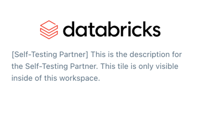

# Self-Testing Partner CLI 
The Self-Testing Partner CLI allows partners to self-test the E2E flow with their integration before fully onboarding.
The CLI will create a Partner Connect tile visible **only** in the partner's workspace.

The APIs called by the CLIs can be called directly as well. (See [API Specifications](APISpecifications.md))

Before using the CLI, please discuss with the Databricks team about whether your product is a fit for Partner Connect.

## Limitations
- Only one self-testing partner can be active at a time in a workspace.
- The Partner Connect tile will have a placeholder description and icon indicating that the tile is for self-testing and
visible only within the partner's workspace.
  - These values can be specified when the partner fully onboards.
- The CLI is not compatible with connection file/desktop application based partners (partners which require downloading a connection
file to use with a locally-installed application).
- The Spark version and instance type for interactive clusters cannot be specified for self-testing partners.

## Usage
1. [Set up the prerequisite requirements](#requirements)
2. [Configure the CLI](#configuration)
3. [Build and run the CLI](#run-the-cli)
4. [Set up authorization](Authorization.md)

## Requirements
1. Maven
   - Set up Maven following [these instructions](../README.md#setup-environment).
   - Maven is not required if you choose to use API directly
2. [Databricks CLI](https://docs.databricks.com/dev-tools/cli/index.html) 
   - The Databricks Secrets CLI is used to securely store endpoint credentials for the self-testing partner.
   - The Authentication setup can be reused for the Self-Testing Partner CLI configuration.
   - This CLI is optional as the underlying API can be called directly. (See [Authorization](Authorization.md))

## Configuration
There are two configuration options: Configuration profiles and environment variables.

Both options use personal access tokens. The Self-Testing Partner CLI does not support using a Databricks username
and password for authentication.

### Option 1: Configuration Profiles (recommend)
This option consists of storing the host name (workspace URL) and token in a configuration profiles file.

Following the [Databricks Configuration Profiles documentation](https://docs.databricks.com/dev-tools/auth.html#configuration-profiles),
set up a configuration profiles file using your personal access token. Profile names other than `[DEFAULT]` are also supported.

If the `DATABRICKS_CONFIG_FILE` environment variable is set, the CLI will use this path instead of the default path (`~/.databrickscfg`).
`DATABRICKS_CONFIG_FILE` must be a full path.

### Option 2: Environment Variables
This option consists of storing the host (workspace URL with the format `https://<instance-name>.cloud.databricks.com`)
and personal access token in the `DATABRICKS_HOST` and `DATABRICKS_TOKEN` environment variables respectively.

#### Example
```
export DATABRICKS_HOST = https://...databricks.com
export DATABRICKS_TOKEN = dapi...
```

## Run the CLI
The CLI uses Maven to create an executable Jar file.
1. `cd` into the `self-testing-partner-cli` directory.
2. Run `mvn clean package`. The location of the jar will be outputted.
3. Run the jar with your specified subcommand and args. (e.g. `java -jar target/self-testing-partner-cli.jar create -f ./sampleConfig.json`)

### Config Specifications
All fields but `delete_url`, `supported_features` and `auth_options` are required.

#### Example
```
{
  "partner": {
    "name": "Test Partner",
    "category": "DATA_PREP_AND_TRANSFORM",
    "connect_url": "https://databricks.com/read/connect",
    "sign_up_url": "https://databricks.com/sign-up",
    "delete_url": "https://databricks.com/delete"
    "terms_of_service_url": "https://databricks.com/tos",
    "privacy_policy_url": "https://databricks.com/privacy",
    "hostnames": "databricks1.com,databricks2.com",
    "supported_features": ["UNITY_CATALOG"],
    "integration_type": "WAREHOUSE_READ",
    "auth_options": ["AUTH_OAUTH_M2M"]
  }
}
```

### Category
`category` must be one of 
`[INGEST, DATA_PREP_AND_TRANSFORM, SECURITY_AND_GOVERNANCE, BI_AND_VIZ, ML, DATA_QUALITY, REVERSE_ETL, SEMANTIC_LAYER, DATA_GOVERNANCE]`.

The category controls where the tile appears on the Partner Connect page.

### Hostnames
`hostnames` is a comma separated string, represent the list of hostnames that will used in the redirected urls.

### Supported Features
`supported_features` is an array containing any of `[UNITY_CATALOG, NON_ADMIN, EXTERNAL_LOCATION]` and can be empty.
`EXTERNAL_LOCATION` only applies to partners who are writing data to Databricks. 
Before using the `NON_ADMIN` feature, contact your SA to discuss non-admin integrations.

### Integration Type
`integration_type` must be one of 
`[NO_INTEGRATION, CLUSTER_COMPUTE, WAREHOUSE_READ, WAREHOUSE_READ_WRITE, WAREHOUSE_WRITE, WORKSPACE_MANAGEMENT]`.

Use the below table to determine the integration type for the self-testing partner. If you have further requirements or questions,
 reach out to your SA.

| Integration Type     | Description                                                                                                                                                                                                                                                                                                                                                                                                                       |
|----------------------|-----------------------------------------------------------------------------------------------------------------------------------------------------------------------------------------------------------------------------------------------------------------------------------------------------------------------------------------------------------------------------------------------------------------------------------|
| NO_INTEGRATION       | No Databricks service principal needed                                                                                                                                                                                                                                                                                                                                                                                            |
| CLUSTER_COMPUTE      | Commonly used by Notebook Partners.<br/>Databricks provides the partner an Interactive Cluster and personal access token (PAT) with permissions.<br/>The partner can use the PAT to publish a Databricks Notebook and configure the Interactive Cluster.                                                                                                                                                                          |
| WAREHOUSE_READ       | Used by partners that only need to read data from the Lakehouse.<br/>In Partner Connect, the user selects which data to grant access to your product.<br/>Databricks provides the partner a SQL Warehouse and PAT with permissions to query that data.<br/>This is often used by **Business Intelligence and Data Quality partners**                                                                                              |
| WAREHOUSE_READ_WRITE | Used by partners that need to read from and write to the Lakehouse.<br/>In Partner Connect, the user selects which catalog to grant write access and which schemas to grant read access for your product.<br/>Databricks provides the partner a SQL Warehouse and PAT with permissions to create schemas and tables in that catalog, as well as query the selected data.<br/>This is often used by **Data Preparation partners**. |
| WAREHOUSE_WRITE      | Used by partners that only need to write (ingest) data into the Lakehouse.<br/>In Partner Connect, the user selects which catalog to grant write access to your product.<br/>Databricks provides the partner a SQL Warehouse and PAT with permissions to create schemas and tables in that catalog.<br/>This is often used by **Ingestion partners**.                                                                             |
| WORKSPACE_MANAGEMENT | Used by partners that need to create clusters and jobs.<br/>Databricks provides the partner with a PAT which can be used to call Databricks REST APIs on clusters in the workspace.<br/>This does not give the partner access to Databricks SQL warehouses.                                                                                                                                                                       |

### Auth Options
`auth_options` is an array containing one of `[AUTH_OAUTH_M2M, AUTH_PAT, AUTH_OAUTH_U2M]` or can be empty. When absent or empty, `AUTH_PAT` will be used.

More auth options are planned to be added in the future.

`AUTH_OAUTH_M2M` and `AUTH_PAT` are mutually exclusive. They cannot be both present at the same time.

If `NON_ADMIN` is in `supported_features`, `AUTH_OAUTH_M2M` is not supported and will fall back to `AUTH_PAT`. Before using the `NON_ADMIN` feature, contact your SA to discuss non-admin integrations.

## Usage
`java -jar target/self-testing-partner-cli.jar [subcommand] [flags]`

### Help
Run `java -jar target/self-testing-partner-cli.jar --help` to view all commands and flags.

### Common Flags
| Name      | Short Name | Description                                                                                                                                                                                                       | Argument Type | Default Value For Argument |
|-----------|------------|-------------------------------------------------------------------------------------------------------------------------------------------------------------------------------------------------------------------|---------------|----------------------------|
| --env     | -e         | If present, DATABRICKS_HOST and DATABRICKS_TOKEN will be used instead of a Databricks config file.                                                                                                                | -             | -                          |
| --profile | -p         | Specifies the name of the profile to be used without the surrounding square brackets (e.g. `SELF-TESTING-CLI`).<br/>This flag is for use with configuration profiles files and will be ignored if `--env` is set. | String        | DEFAULT                    |

If both flags are specified, `--env` takes precedence.

#### Examples
##### Use environment variables instead of a Databricks configuration profile file
`java -jar target/self-testing-partner-cli.jar create -f ./sampleConfig.json -e`

`java -jar target/self-testing-partner-cli.jar delete --env`

##### Use a different profile name than DEFAULT
`java -jar target/self-testing-partner-cli.jar delete -p "SELF-TESTING-CLI"`

`java -jar target/self-testing-partner-cli.jar create -f ./sampleConfig.json --profile "SELF-TESTING-CLI"`

### Create
Create takes in the path to a json config file which contains the fields used to set up the self-testing partner and
returns the ID of the created partner.

The created self-testing partner will be visible in Partner Connect only for the workspace configured in the
[Configuration step](#configuration).

#### Example Tile



#### Authorization
After creating a self-testing partner, [**set up authorization**](Authorization.md).

**The self-testing partner cannot be used without setting up authorization.**

#### Flags
| Name | Short Name | Description                                                                                                  | Argument Type | Default Value For Argument |
|------|------------|--------------------------------------------------------------------------------------------------------------|---------------|----------------------------|
| file | -f         | The path to the config file for the self-testing partner (e.g. `~/sampleConfig.json`, `./sampleConfig.json`) | String        | -                          |

#### Example
`java -jar target/self-testing-partner-cli.jar create -f ./sampleConfig.json`

### Get
The Get command returns the IDs and names of active self-testing partners in the workspace.
#### Flags
No additional flags

#### Example
`java -jar target/self-testing-partner-cli.jar get`

### Update
The Update command takes in the path to a json config file and updates the self-testing partner.
Any existing connections will be deleted.
#### Flags
| Name | Short Name | Description                                                                                                  | Argument Type | Default Value For Argument |
|------|------------|--------------------------------------------------------------------------------------------------------------|---------------|----------------------------|
| file | -f         | The path to the config file for the self-testing partner (e.g. `~/sampleConfig.json`, `./sampleConfig.json`) | String        | -                          |

The format of the config file is the same as for Create.

#### Example
`java -jar target/self-testing-partner-cli.jar update -f ./config-v2.json`

### Delete
The Delete command will delete the active self-testing partner if there is one. Any existing connections will be deleted.
#### Flags
No additional flags

#### Example
`java -jar target/self-testing-partner-cli.jar delete`

## Tests
Run `mvn test` to run unit tests.
